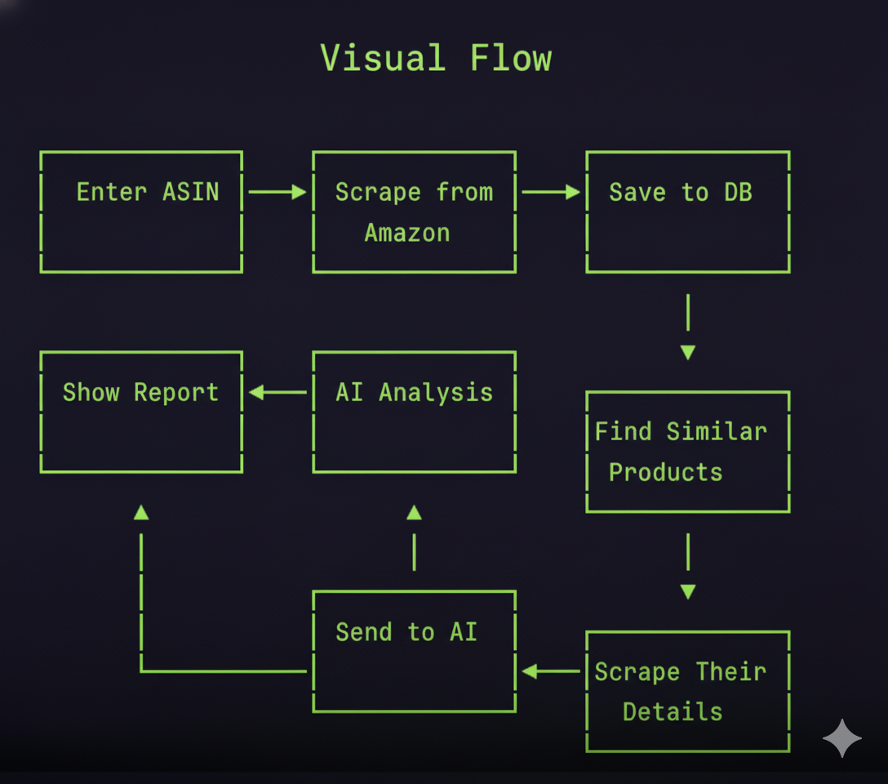

# Amazon Competitor Analysis

A simple Streamlit application to perform competitor analysis on Amazon products. Users can input a product's ASIN, a postal code for localization, and the desired Amazon domain to retrieve insights.

## Screenshot

Here is a screenshot of the application's user interface.


## Workflow

This diagram illustrates the data flow and architecture of the application.



## Getting Started

Follow these instructions to get a copy of the project up and running on your local machine.

### Prerequisites

*   Python 3.7+
*   pip

### Installation

1.  Clone the repository.
2.  Install the required Python packages:
    ```bash
    pip install streamlit
    ```

### Running the Application

To start the Streamlit server, run the following command in your terminal:

```bash
streamlit run main.py
```