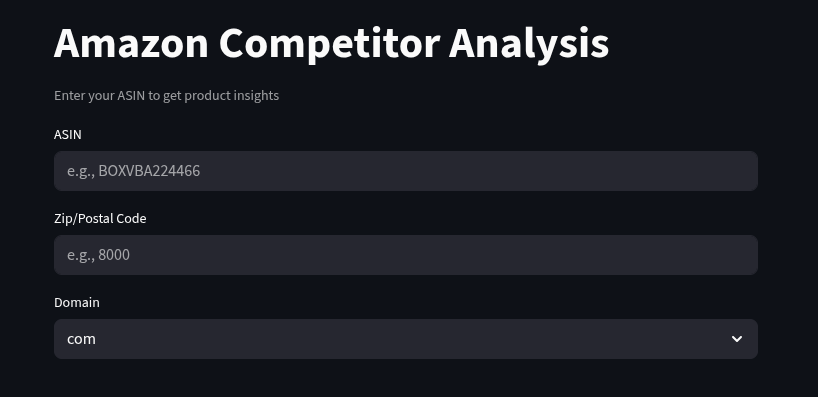

# Amazon Competitor Analysis

A Streamlit application for analyzing Amazon product competitors. Input a product's ASIN, postal code, and Amazon domain to gather competitive insights.

## Screenshots




## Architecture


## Setup

### Requirements
- Python 3.7+
- pip

### Installation
1. Clone the repository.
2. Install dependencies: `pip install streamlit`

### Run
Execute the following command:
```bash
streamlit run main.py
